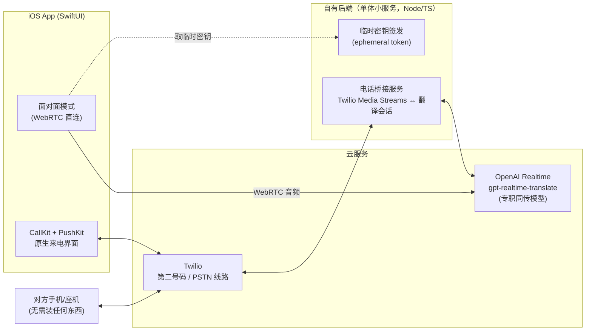

# 实时同传翻译 App — 产品需求文档（PRD）

> 版本：v1.0 ｜ 日期：2026-07-18 ｜ 性质：家庭自用，不上架、不对外发布

---

## 1. 背景与定位

**用户**：常年生活在国外的中文家庭（2–6 人），经常前往其他国家旅行。

**核心问题**：现有翻译产品（Google 翻译、Apple 翻译等）无法覆盖真实生活中的两大高频场景——

1. **接打电话**：接到当地语言的电话（银行、诊所、快递、政府机构）完全听不懂；通话中无法打开翻译软件，打开了也接不进通话音频。
2. **面对面交流**：环境嘈杂、不可能给对方戴耳机；现有 app 是"说一句 → 按一下 → 等翻译 → 给对方看"的回合制，效率低，达不到同传体验。

**产品定位**：一个 iOS app + 一个自有小后端，内置云端大模型同传引擎，把"电话翻译"和"面对面同传"做成**一键可用、双向实时、对方零门槛**（对方不需要装任何东西）的私人翻译器。

**明确不做**：不上架 App Store、不做用户增长、不做多租户商业化。分发走 TestFlight 家庭内部分发。

---

## 2. 产品目标与成功标准

| 目标 | 衡量标准 |
|---|---|
| 电话听得懂、说得通 | 来电/拨出全程双向同传；对方说完一句后 **≤ 1.5 秒**听到中文译音 |
| 接电话一键化 | 来电走 iPhone **系统原生来电界面**，锁屏滑动即接，无需先开 app |
| 面对面准同传 | 对方说话过程中即开始流式出译音，整体延迟感 **≤ 2 秒**，无回合制操作 |
| 语言即到即用 | 对方开口自动识别语种，无需手动切换 |
| 家人可用 | 非技术家庭成员完成一次性设置后可独立使用 |

---

## 3. 核心场景与用户流程

### 3.1 场景 A：接听来电翻译（P0）

**一次性设置**（每人一次，app 内引导完成）：
1. app 为用户分配一个**第二号码**（云端 VoIP 号码，Twilio 提供）；
2. 用户在运营商设置**呼叫转移**到第二号码（app 内提供各国运营商的转移代码，一键拨号开通，如 `**21*号码#`）；
3. 设置默认语言对（如 中文 ↔ 当地语言），支持来电语种自动识别兜底。

**来电流程**：
```
对方拨打你的手机号
  → 运营商呼叫转移至第二号码（Twilio）
  → 后端桥接服务收到来电，向 app 推送 VoIP Push
  → iPhone 弹出系统原生来电界面（CallKit），锁屏滑动接听
  → 通话中：对方说当地语言 → 你听到中文译音；
            你说中文 → 对方听到当地语言译音
```

**体验要求**：
- 接听动作与接普通电话完全一致，**零额外点击**；
- 通话中可随手切换"翻译开/关"（对方是中文人士时直通）；
- 通话记录进入 app 内历史列表（号码、时长、语言对）。

### 3.2 场景 B：拨出电话翻译（P0）

1. 在 app 内输入号码或从系统通讯录选人（支持读取 iOS 通讯录）；
2. 选择对方语言（记住上次选择；常用联系人可绑定语言）；
3. 拨出 → 电话经 Twilio 线路接通对方真实号码 → 全程双向同传。

对方接到的是一个普通来电（显示你的第二号码），**无需安装任何东西**。

### 3.3 场景 C：面对面同传（P0）

1. 打开 app 点"面对面"（另配锁屏 Widget / 控制中心按钮 / Action Button 快捷指令，一步进入）；
2. 手机放在两人中间，扬声器外放；
3. 双方各说各的语言：模型自动识别说话人语种，**边听边译**、流式播出对方语言的译音（同传，非回合制）；
4. 嘈杂环境依赖模型端降噪 + 手机麦克风阵列拾音；
5. 结束点一下停止。

**体验要求**：
- 双向两路翻译会话并行（他→你、你→他），互不等待；
- 说话过程中即开始出译音（流式，200ms 级音频块）；
- 屏幕仅显示极简状态（在听/在译/语言对），核心呈现是**同传语音**。

### 3.4 兜底场景（P1）

- **免提模式**：来电未走呼叫转移时（如临时关闭转移），可开免提，用 app 麦克风听通话声音做单向翻译给自己，译音外放对方也能听到；
- **iOS 26 原生通话翻译**：系统自带 Live Translation 作为免费备用方案，写入使用手册，不作为产品主路径（语言少、质量一般）。

---

## 4. 功能需求清单

| 优先级 | 功能 | 说明 |
|---|---|---|
| P0 | 面对面双向同传（语音） | 自动语种识别、流式译音、扬声器外放 |
| P0 | 拨出电话翻译 | app 拨号 → Twilio 线路 → 双向同传 |
| P0 | 来电翻译 | 第二号码 + 呼叫转移 + CallKit 原生接听 |
| P0 | 语言对管理 | 默认语言对、按联系人记忆、自动识别兜底 |
| P0 | 通话/会话历史 | 号码、时长、语言对（不默认保存音频） |
| P0 | 呼叫转移引导 | 各国运营商转移代码库、一键开通/关闭 |
| P1 | 快捷入口 | 锁屏 Widget、控制中心、Action Button、Siri 快捷指令 |
| P1 | 免提兜底模式 | 未转移时的单向翻译 |
| P1 | 家庭成员管理 | 每人独立第二号码与语言偏好，共享一个后端 |
| P1 | 用量看板 | 当月分钟数与费用估算 |
| P2 | 实时双语字幕 | 原文+译文上屏（本期不做，架构预留） |
| P2 | 通话小结 | 挂断后自动生成要点记录（本期不做，架构预留） |
| P2 | 离线降级 | 无网时切端侧小模型（质量降级，本期不做） |

---

## 5. 语言支持

- **P0 语言对**（均与中文互译，双向）：英语、日语、韩语、西班牙语、法语、德语、意大利语；
- 输入侧支持 **70+ 语种自动识别**（模型能力自带），旅行到未预设语言的国家也能用；
- 语言对可扩展，仅是配置项，不涉及架构改动。

---

## 6. 技术方案

### 6.1 总体架构



### 6.2 面对面同传

- app 通过 **WebRTC 直连 OpenAI Realtime API**，使用专职同传模型 `gpt-realtime-translate`（以职业同传音频训练，边听边译、流式输出、自动语种识别）；
- 双人对话开**两路会话**：A→B 一路、B→A 一路，各自以听者语言为目标，并行互不阻塞；
- 后端只负责签发临时密钥（API Key 不进 app），无媒体流经过自有服务器，延迟最低；
- 参考实现：OpenAI 官方 [realtime_translation_guide](https://github.com/openai/openai-cookbook/blob/main/examples/voice_solutions/realtime_translation_guide.mdx)。

### 6.3 电话翻译

- **号码与线路**：Twilio 每人一个号码；来电（经呼叫转移）与拨出都落在 Twilio 上；
- **桥接服务**：Twilio Media Streams（8kHz μ-law）↔ 重采样 ↔ OpenAI Realtime（24kHz PCM16），双向各一路翻译会话；
- **iOS 侧**：CallKit + PushKit（VoIP Push）实现原生来电界面与锁屏接听；通话音频走 app 的 VoIP 通道（Twilio Voice iOS SDK）；
- 参考实现：[twilio-samples/live-translation-openai-realtime-api](https://github.com/twilio-samples/live-translation-openai-realtime-api)（官方双向电话翻译样例）、[sip-to-ai](https://github.com/aicc2025/sip-to-ai)、[LiveKit Agents + SIP](https://github.com/livekit/agents)（备选桥接框架）。

### 6.4 后端与部署

- 单体小服务（Node/TypeScript），职责：临时密钥签发、Twilio webhook、媒体桥接、VoIP 推送、用量记录；
- 部署在 Fly.io / Railway 级别的托管平台（单实例即可，家庭负载极小）；选择靠近常住国的机房以压延迟；
- 配置即代码：家庭成员、号码、语言偏好用一个配置文件管理。

### 6.5 隐私

- 音频**不落盘、不留存**，只做实时转译流转；历史记录仅存元数据（号码/时长/语言对）；
- API Key 只存在后端；app 与后端间走 HTTPS + 简单设备令牌（自用，不做完整账号体系）。

---

## 7. 成本估算（质量优先档）

> 以下为估算区间，实施时以 OpenAI / Twilio 官网现行价格核算细账。

| 项目 | 费用 |
|---|---|
| Apple 开发者账号（TestFlight 分发必需） | $99 / 年 |
| Twilio 第二号码 | 约 $1–2 / 月 / 人 |
| Twilio 通话线路（来电+拨出，双腿） | 约 $0.02–0.04 / 分钟 |
| 运营商呼叫转移资费 | 视当地套餐，多数按拨出本地电话计费或包含在套餐内 |
| 同传模型（电话，双向两路会话） | 约 $0.2–0.4 / 分钟 |
| 同传模型（面对面，双向） | 约 $0.1–0.3 / 分钟 |
| 后端托管 | 约 $5–10 / 月 |

**月度参考**：按一家人每月 100 分钟电话 + 200 分钟面对面估算，约 **$40–80 / 月**；轻度使用月份约 $15–30。app 内做用量看板，费用透明。

---

## 8. 里程碑

| 阶段 | 内容 | 验收标准 |
|---|---|---|
| **M1 面对面同传 MVP** | iOS app + 临时密钥后端 + 双向同传 | 中英/中日面对面真实对话可用，延迟感 ≤2s，TestFlight 装机 |
| **M2 拨出电话翻译** | Twilio 线路 + 桥接服务 + app 拨号 | 拨真实号码全程双向同传，对方无感知门槛 |
| **M3 来电翻译** | 第二号码 + 呼叫转移引导 + CallKit/PushKit 原生接听 | 锁屏滑动接起转移来电并全程翻译 |
| **M4 打磨与家庭化** | 快捷入口、家庭成员管理、用量看板、免提兜底 | 家人独立完成设置并日常使用 |

依赖前置：Apple 开发者账号、OpenAI API 账号、Twilio 账号（M2 前开通即可）。

---

## 9. 风险与应对

| 风险 | 影响 | 应对 |
|---|---|---|
| 呼叫转移后**紧急电话/验证码短信**不受影响，但普通来电全部进 app | 若 app/后端故障则漏接 | 后端故障时 Twilio 侧配置降级：转回真实号码/直接透传不翻译；app 内一键关闭转移 |
| 部分运营商/eSIM 对呼叫转移收费或限制 | 个别号码来电场景受限 | 引导页内按运营商标注；不可用时走免提兜底 |
| TestFlight 构建 90 天过期 | 需定期重新分发 | 后续可改 Ad Hoc 签名或自动化重新上传 |
| 模型对小语种/重口音质量波动 | 个别对话体验下降 | 语言对可配置备选引擎；架构上翻译引擎做成可替换模块 |
| Apple 政策变化（CallKit/VoIP Push） | 来电路径需调整 | 自用 app 风险低；保留免提兜底与 iOS 26 原生翻译备用路径 |
| 通话对端在弱网/嘈杂环境 | 识别质量下降 | 模型端降噪 + 必要时提示放慢语速；后续可加字幕辅助（P2） |

---

## 10. 参考与依据

- OpenAI 官方同传架构指南（`gpt-realtime-translate`）：github.com/openai/openai-cookbook — `examples/voice_solutions/realtime_translation_guide.mdx`
- Twilio 官方电话实时翻译样例：github.com/twilio-samples/live-translation-openai-realtime-api
- SIP → 实时 AI 桥接：github.com/aicc2025/sip-to-ai
- LiveKit Agents（备选桥接框架）：github.com/livekit/agents ／ livekit-examples/phone-assistant
- 交互先例：github.com/niedev/RTranslator（开源实时翻译 app）
- 商业形态验证（第二号码 + 呼叫转移路线）：AI Phone（aiphone.ai）、AI Call（1aicall.com）
- Apple：iOS 26 Live Translation（support.apple.com/en-us/123720）、CallKit `CXSetTranslatingCallAction`
