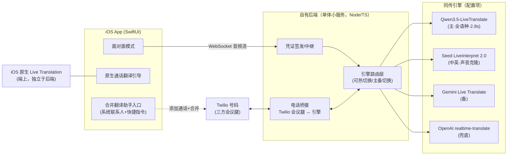

# 实时同传翻译 App — 产品需求文档（PRD）

> 版本：v2.0 ｜ 日期：2026-07-18 ｜ 性质：家庭自用，不上架、不对外发布
>
> v2.0 变更：① 电话方案弃用「第二号码 + 呼叫转移」，改为「iOS 原生通话翻译为主 + 合并翻译助手增强」三层方案；② 面对面同传引擎从 OpenAI 单引擎改为多引擎路由（Qwen3.5-LiveTranslate 主引擎），延迟目标对齐顶级人类同传员水平。

---

## 1. 背景与定位

**用户**：常年生活在国外的中文家庭（2–6 人），经常前往其他国家旅行。

**核心问题**：
1. **接打电话**：接到当地语言的电话（银行、诊所、快递、政府机构）听不懂；通话中无法使用普通翻译软件。
2. **面对面交流**：环境嘈杂、不可能给对方戴耳机；现有 app 是回合制翻译，达不到同传体验。

**产品定位**：一个 iOS app + 一个自有小后端。电话场景以 **iOS 原生通话翻译**为主路径、以自建**合并翻译助手**为质量增强路径；面对面场景内置**当前业界最强的云端同传模型（多引擎路由）**，做到人类同传员级的实时性。对方始终零门槛（不装任何东西）。

**明确不做**：不上架 App Store、不做商业化；不使用第二号码、不改动用户的真实手机号和来电路径。

---

## 2. 产品目标与成功标准

| 目标 | 衡量标准 |
|---|---|
| 电话听得懂、说得通 | 来电/拨出全程双向翻译，覆盖全部目标语言 |
| 接电话一键化 | 来电正常接听（真实号码，路径零改动），通话界面内一键开启翻译 |
| 面对面"无延迟感"同传 | **反应延迟 < 1 秒**（对方开口到译音开始）；**语义滞后 2–3 秒**（对齐顶级人类同传员的 ear-voice span） |
| 语言即到即用 | 对方开口自动识别语种（主引擎支持 60 语种输入） |
| 家人可用 | 非技术家庭成员完成一次性设置后可独立使用 |

> 关于"无延迟"的诚实定义：任何同传（包括人类顶级译员）都必须先听到足够语义才能开口，语序差异决定了 2–3 秒语义滞后是物理下限。本产品把**可压缩的部分压到极限**——流式首音 200–300ms 级、边听边译——体验上做到"对方还在说，翻译已经在出"。

---

## 3. 核心场景与用户流程

### 3.1 场景 A：电话翻译（来电 + 拨出，P0）— 三层方案

**第 1 层 · 主路径：iOS 原生通话实时翻译（Live Translation）**

- 苹果 iOS 26 起在普通运营商电话中内置实时翻译：通话中点「更多 → 实时翻译」，你说中文对方听到当地语言，对方说话你听到中文，**双向语音，来电拨出都可用**；
- 当前支持语言已覆盖本产品全部目标语言：**中文（简/繁）、英、日、韩、西、法、德、意、葡**；
- 真实号码不变、无需任何转移设置、免费、端上运行（离线也可用）；
- app 内提供设置引导页：预下载语言包、按国家推荐默认语言对、家人手机逐台配置检查。
- **要求**：支持 Apple Intelligence 的机型（iPhone 15 Pro / iPhone 16 及之后），iOS 26+。

**第 2 层 · 增强路径：合并翻译助手（Merge-Bot，本产品自建）**

原生翻译质量不够时使用（重口音、银行/医疗等专业术语、苹果列表外的语言如荷兰语/泰语、老款 iPhone）：

```
通话中（来电或拨出均可）
  → 点「添加通话」，拨联系人「翻译助手」（我们的 Twilio 号码）
  → 点「合并」→ 三方电话会议
  → 助手接入自有后端：旗舰云端同传模型 + 自定义术语表
  → 双方的话被实时互译，译音双方都能听到
```

- 真实号码与来电路径零改动；后端故障不影响正常通话（最坏情况=没有翻译）；
- 通话前也可在 app 里先选语言对/场景术语表（银行、医疗、政务预设）；
- 老款 iPhone 也能用（仅依赖系统会议通话能力）。

**第 3 层 · 兜底：免提模式**

不方便合并时开免提，app 用麦克风听通话声做翻译、译音外放（复用面对面引擎）。

### 3.2 场景 B：面对面同传（P0）

1. 打开 app 点「面对面」（锁屏 Widget / 控制中心 / Action Button 一步进入）；
2. 手机放两人中间，扬声器外放；双方各说各的语言，**自动识别语种、边听边译、流式播出译音**（同传，非回合制）；
3. 双向两路翻译并行、互不等待；嘈杂环境靠模型端降噪 + 麦克风阵列拾音；
4. 可选配合 AirPods：译音进耳机、ANC 压低环境音（旅行时体验更好，非必需）。

### 3.3 翻译引擎策略（本产品的核心竞争力）

单一模型不是最优解，2026 年各家同传模型各有强项且迭代极快，因此架构上做**引擎抽象层 + 按语言对路由**，引擎是配置项、可热切换：

| 角色 | 引擎 | 依据（2026-07 调研） |
|---|---|---|
| **默认主引擎（全语种）** | 阿里 **Qwen3.5-LiveTranslate-Flash**（阿里云 Model Studio 国际版，WebSocket 实时接口） | 平均语义滞后 **2.8 秒**（当前公开最低）；60 语种输入 / 29 语种语音输出，覆盖全部目标语言对；中文为核心优化；支持运行时注入术语表 |
| **中↔英质量天花板（可选升级）** | 字节 **Seed LiveInterpret 2.0**（火山引擎/BytePlus） | 人评质量最接近人类同传员（中→英 VIP 79.5%）；2–3 秒滞后；**零样本声音克隆**——用你自己的声音说英语。海外开通有账号摩擦，开通失败不阻塞产品 |
| **备用引擎 1** | 谷歌 **Gemini Live Translate** | 平均滞后 2.9 秒，90+ 语种，可用性/配额好 |
| **备用引擎 2** | OpenAI gpt-realtime-translate 系 | 基准中平均滞后 3.6 秒，作兜底与对照 |

- 主备切换策略：主引擎连接失败/延迟劣化自动切备用；每语言对的引擎选择可在配置中覆写；
- 电话 Merge-Bot 与面对面共用同一引擎路由层（电话侧 8kHz 音频重采样后接入）。

---

## 4. 功能需求清单

| 优先级 | 功能 | 说明 |
|---|---|---|
| P0 | 面对面双向同传（语音） | 引擎路由、自动语种识别、流式译音、扬声器外放 |
| P0 | 电话翻译·原生路径引导 | Live Translation 设置向导、语言包预下载、按国家推荐语言对 |
| P0 | 电话翻译·合并翻译助手 | Twilio 会议腿 + 后端桥接 + 引擎路由；「翻译助手」系统联系人一键添加 |
| P0 | 语言对管理 | 默认语言对、自动识别兜底、场景术语表（银行/医疗/政务预设） |
| P0 | 会话历史 | 时间、时长、语言对元数据（不默认保存音频） |
| P1 | 快捷入口 | 锁屏 Widget、控制中心、Action Button、Siri 快捷指令 |
| P1 | 免提兜底模式 | 未合并助手时的通话翻译 |
| P1 | 家庭成员管理 | 每人语言偏好、共享一个后端与配额 |
| P1 | 用量看板 | 当月分钟数与费用估算 |
| P1 | AirPods 配合模式 | 译音入耳、ANC 配合（旅行场景） |
| P2 | Seed 声音克隆升级 | 中英对话用本人音色输出译文 |
| P2 | 实时双语字幕 / 通话小结 | 架构预留，本期不做 |
| P2 | 离线降级 | 无网时切端侧模型（另：原生 Live Translation 本身可离线，已是兜底） |

---

## 5. 语言支持

- **P0 语言对**（均与中文互译，双向）：英、日、韩、西、法、德、意；
- 电话原生路径：中（简/繁）、英、日、韩、西、法、德、意、葡（苹果列表，随系统更新扩展）；
- 面对面 & Merge-Bot：主引擎 60 语种输入自动识别 / 29 语种语音输出，旅行到列表外国家也可用；
- 语言对为配置项，扩展不涉及架构改动。

---

## 6. 技术方案

### 6.1 总体架构



### 6.2 关键实现要点

- **面对面**：app 经后端轻量中继（或短时凭证直连，视各引擎鉴权能力实现期定）建立 WebSocket 音频流；双人对话开 A→B、B→A 两路会话并行；API Key 一律不进 app；
- **电话 Merge-Bot**：Twilio 号码作为会议第三方接入，Media Streams（8kHz μ-law）↔ 重采样 ↔ 引擎（16/24kHz PCM）双向桥接；助手号码做成系统联系人一键添加；参考 twilio-samples/live-translation-openai-realtime-api 的桥接实现（引擎侧替换为路由层）；
- **引擎路由层**：统一的"音频进/音频出 + 术语表 + 语言对"接口，四家引擎各写适配器；延迟与断连指标上报，自动降级；
- **部署**：Fly.io / Railway 级托管，单实例，机房选常住国就近；家庭成员、语言偏好、引擎配置用一个配置文件管理。

### 6.3 隐私

- 音频不落盘、不留存，仅实时流转；历史仅存元数据；
- 原生路径完全端上处理（苹果侧隐私最优）；云端引擎仅在面对面/Merge-Bot 时使用；
- app 与后端走 HTTPS + 设备令牌（自用，不做完整账号体系）。

---

## 7. 成本估算

> 估算区间，实施时按各家现行价格核细账。相比 v1.0（第二号码方案）成本显著下降：原生路径免费，云端仅按实际使用分钟计费。

| 项目 | 费用 |
|---|---|
| Apple 开发者账号（TestFlight 分发） | $99 / 年 |
| 电话·原生路径 | **免费**（端上模型） |
| 电话·Merge-Bot：Twilio 号码（全家共用 1–2 个） | 约 $1–3 / 月 |
| 电话·Merge-Bot：会议腿线路 | 约 $0.01–0.03 / 分钟 |
| 同传引擎（面对面 / Merge-Bot） | 约 $0.05–0.3 / 分钟（Qwen 档位为主，低于 OpenAI 档） |
| 后端托管 | 约 $5–10 / 月 |

**月度参考**：日常电话大部分走免费原生路径；按每月 50 分钟 Merge-Bot + 200 分钟面对面估算约 **$15–45 / 月**；轻度使用月份 < $15。

---

## 8. 里程碑

| 阶段 | 内容 | 验收标准 |
|---|---|---|
| **M1 面对面同传 MVP** | app + 引擎路由层（先接 Qwen 主引擎 + 一个备用）+ 原生通话翻译引导页 | 中英/中日真实对话：反应延迟 <1s、语义滞后 2–3s；全家 TestFlight 装机；电话场景可用原生路径过渡 |
| **M2 电话合并翻译助手** | Twilio 会议腿 + 桥接服务 + 术语表 + 联系人/快捷指令集成 | 真实来电中 3 步内接入助手，双向翻译流畅，银行/诊所场景实测可用 |
| **M3 家庭化打磨** | 快捷入口、成员管理、用量看板、免提兜底、AirPods 配合 | 家人独立完成设置并日常使用 |
| **M4 增强项** | Seed LiveInterpret 接入（声音克隆）、引擎基准回归、字幕/小结（视需求） | 中英对话以本人音色输出 |

依赖前置：Apple 开发者账号、阿里云 Model Studio 国际版账号（M1）、Twilio 账号（M2）、Gemini/OpenAI API（备用引擎）、BytePlus（M4，可选）。

---

## 9. 风险与应对

| 风险 | 影响 | 应对 |
|---|---|---|
| 家人手机非 Apple Intelligence 机型（iPhone 15 Pro 之前） | 原生路径不可用 | Merge-Bot 与免提路径不依赖机型；换机前以增强路径为主 |
| 个别运营商不支持三方会议通话或额外收费 | Merge-Bot 受限 | 引导页按运营商标注；不可用时走免提兜底 |
| 阿里云国际版/BytePlus 账号开通摩擦 | 主引擎或增强引擎延迟接入 | 引擎路由天然多备份：Gemini/OpenAI 可即时顶替主引擎 |
| 同传模型市场迭代极快（半年一代） | 今日选型三个月后非最优 | 引擎抽象层 + 配置热切换；每季度跑一次基准回归换主引擎 |
| 原生 Live Translation 语言/质量受苹果节奏制约 | 个别语言体验波动 | 三层方案互为备份，不单点依赖苹果 |
| 弱网/嘈杂环境识别质量下降 | 个别对话体验下降 | 模型端降噪；自动切换更稳引擎；后续字幕辅助（P2） |
| TestFlight 构建 90 天过期 | 需定期重新分发 | 自动化重新上传；必要时 Ad Hoc 签名 |

---

## 10. 已否决方案（避免重复讨论）

| 方案 | 否决原因 |
|---|---|
| 第二号码 + 呼叫转移（v1.0 主方案） | 需改动真实来电路径、对方看到陌生号码、转移资费与漏接风险、家人设置负担；被原生 Live Translation（免费、真实号码、零改动）+ Merge-Bot（质量增强）组合全面替代 |
| OpenAI 单引擎 | 2026-07 基准中平均语义滞后 3.6s，落后于 Qwen3.5-LiveTranslate（2.8s）、Gemini（2.9s）；中文非其优化重心；保留为兜底引擎 |
| 端侧大模型为主 | 质量与嘈杂环境识别不达标；原生 Live Translation 已提供免费端侧兜底 |

---

## 11. 参考与依据（2026-07 调研）

- 苹果通话/信息/面对面实时翻译（语言列表含中/英/日/韩/西/法/德/意/葡）：support.apple.com/guide/iphone/iph22b72984d ／ support.apple.com/en-us/123720
- Qwen3.5-LiveTranslate-Flash（2.8s、60 语种、术语表）：qwen.ai/blog?id=qwen3.5-livetranslate ／ 阿里云 Model Studio `qwen3-5-livetranslate-flash-realtime`
- Seed LiveInterpret 2.0（近人类同传质量、声音克隆）：seed.bytedance.com ／ arxiv.org/abs/2507.17527
- Gradium 同传基准对比（gpt-realtime-translate 3.6s / gemini-live-translate 2.9s / gradium 3.0s）：marktechpost.com 2026-06-24 报道 ／ gradium.ai/translate
- 电话桥接参考实现：github.com/twilio-samples/live-translation-openai-realtime-api ／ github.com/aicc2025/sip-to-ai ／ github.com/livekit/agents
- 会议合并式电话口译形态先例：Chatlas（merge-call interpreter）
- 交互先例：github.com/niedev/RTranslator
