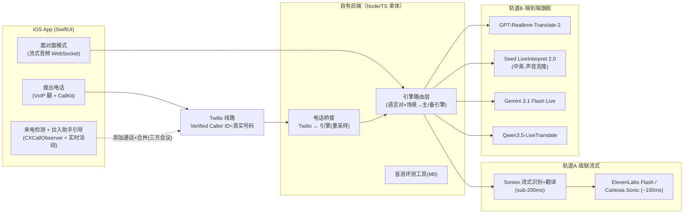

# 实时同传翻译 App — 产品需求文档（PRD）

> 版本：v3.0 ｜ 日期：2026-07-18 ｜ 性质：家庭自用，不上架、不对外发布
>
> v3.0 变更：① 彻底移除 iOS 原生翻译作为产品路径（用户实测质量不达标，入已否决清单）；② 翻译引擎改为「双轨 + 家庭真实场景盲测定型」——级联流式管线轨（反应 <0.5s）+ 端到端旗舰模型轨（2026-05/06 新一代），引擎全部可热换；③ 电话方案改为自研全链路：拨出走自有线路且**来电显示真实号码**，来电走「先接听、两步拉入翻译助手」+ 免提兜底。

---

## 1. 背景与定位

**用户**：常年生活在国外的中文家庭（2–6 人），经常前往其他国家旅行。

**核心问题**：
1. **接打电话**：接到当地语言的电话（银行、诊所、快递、政府机构）听不懂；通话中无法使用普通翻译软件。
2. **面对面交流**：环境嘈杂、不可能给对方戴耳机；现有 app 是回合制翻译，达不到同传体验。
3. 现有产品（Google/Apple 原生翻译、市面 app）质量与实时性均不达标——这正是自研的理由。

**产品定位**：一个 iOS app + 一个自有小后端，自研整条翻译链路：接入当代最强的实时同传引擎（多引擎、可热换、按家庭真实场景盲测定型），把电话与面对面两个场景做到**反应无感延迟、双向同传、对方零门槛**（不装任何东西、来电显示真实号码）。

**明确不做**：不上架 App Store、不商业化；不依赖 Google/Apple 原生翻译；不改动用户真实号码的来电路径（不用第二号码、不设呼叫转移）。

---

## 2. 产品目标与成功标准

| 目标 | 衡量标准 |
|---|---|
| 面对面"无延迟反应" | **首译音反应 ≤ 0.5 秒**（对方话没说完，译音已经开始）；整句语义滞后 1.5–3 秒按"快/稳"挡位可调 |
| 电话听得懂、说得通 | 拨出/来电全程双向同传；对方侧来电显示为你的真实号码 |
| 接电话低摩擦 | 来电正常接听（路径零改动）；听不懂时 **2 步**拉入翻译助手 |
| 译质天花板 | 主引擎由家庭真实场景盲测选出，支持场景术语表（银行/医疗/政务）；中英可用本人音色输出 |
| 语言即到即用 | 自动识别对方语种；7 组 P0 语言对全覆盖，长尾语言有兜底引擎 |
| 家人可用 | 非技术家庭成员一次设置后独立使用 |

> 「无延迟」的工程定义：**反应延迟**（对方开口→译音开始）压到 0.3–0.5 秒，这是流式管线当前的真实能力；**语义滞后**（一句话意思完整译出）受语言学限制存在下限，顶级人类同传员为 2–4 秒，本产品做到 1.5–3 秒且挡位可调。体验目标：永远不出现"说完等翻译"的死等感。

---

## 3. 翻译引擎策略（核心决策）

### 3.1 双轨引擎

**轨道 A · 级联流式管线（反应速度轨，默认）**
流式识别+翻译（Soniox 实时翻译，sub-200ms token 级流式，60 语种覆盖全部 P0 语言对；备选 Deepgram Nova-3 / AssemblyAI Universal-Streaming + 翻译 LLM）→ 流式合成（ElevenLabs Flash / Cartesia Sonic，~100ms 首音）。
- 端到端首译音 **0.3–0.5 秒**（开发者社区验证的当前最优反应速度）；
- 逐词流式上屏 + 增量修正；术语表、语气、按语言对单独调优全部可控；
- 多对多语言译质在开发者社区共识中优于端到端一体模型。

**轨道 B · 端到端旗舰模型（译质轨，按语言对启用）**

| 引擎 | 定位 | 依据（2026-07） |
|---|---|---|
| **GPT-Realtime-Translate-2**（OpenAI，2026-05 发布） | E2E 主力候选 | 当代实时语音 SOTA；嘈杂环境+插话的 Audio MultiChallenge 70.8%（约为 Gemini 3.1 Flash Live 36.1% 的 2 倍）；70+ 输入语种；60 分钟长会话适合电话 |
| **Seed LiveInterpret 2.0**（字节，火山引擎/BytePlus） | 中↔英质量天花板 | 中文社区实测首字 1.2s；中英人评 74.8/100 接近人类同传员；**零样本声音克隆**（本人音色说外语） |
| **Gemini 3.1 Flash Live**（谷歌，2026-03） | 长尾语言 + 低成本兜底 | ~200ms 反应、200+ 语种、有免费档；缺点：单会话 10 分钟需重连 |
| **Qwen3.5-LiveTranslate-Flash**（阿里，2026-05） | 中文侧备选 | 60 语种、2.8s 语义滞后、运行时术语表注入 |

### 3.2 盲测定型（M0，开工第一件事）

不信任何厂商跑分——用**家庭真实场景**建测试集（嘈杂街头对话、带口音的银行/诊所电话录音风格素材、7 组语言对各若干条），双轨全部引擎跑同一测试集，家人盲听打分（译质/反应/听感），据此写入路由配置：**每组语言对 × 每个场景（电话/面对面）→ 指定主引擎与备引擎**。

### 3.3 路由与热换

- 统一引擎抽象层（音频进/音频出 + 语言对 + 术语表 + 挡位），各引擎写适配器；
- 运行时按路由表选引擎，故障/延迟劣化自动切备；
- **每季度重跑盲测**换主引擎——该市场 3 个月一洗牌（本文档 v1→v3 两天内选型换了三代），架构上不绑死任何一家。

---

## 4. 核心场景与用户流程

### 4.1 场景 A：拨出电话翻译（P0）

```
app 内拨号 / 从系统通讯录选人（常用联系人可绑定语言与术语表）
  → 呼叫经自有线路（Twilio）接通对方真实号码
  → 对方来电显示 = 你的真实手机号（Twilio Verified Caller ID，一次性验证）
  → 通话中双向同传（引擎路由，电话侧 8kHz 音频重采样接入）
  → 你说中文对方听目标语，对方说话你听中文；随时可暂停翻译直通
```

- 对方无需装任何东西，也不会看到陌生号码；
- app 侧走 VoIP 腿（宽带音频）+ CallKit，体验与原生通话一致，支持锁屏/蓝牙/车机。

### 4.2 场景 B：来电翻译（P0）

**平台边界（如实说明）**：iOS 封死了第三方 app 获取运营商来电音频的能力——这是苹果对所有 app（含全部商业翻译 app）的硬限制，物理上仅存在三条路：呼叫转移（已否决）、通话中拉入第三方、免提采音。据此设计：

**主路径「拉入翻译助手」**：
```
来电正常响铃、正常接听（真实号码，路径零改动）
  → 听不懂 → app 已检测到通话中（CXCallObserver），
    在灵动岛/实时活动弹出「拉入翻译助手」引导
  → 两步：「添加通话」拨『翻译助手』联系人 →「合并」
  → 三方会议：助手（自有后端+旗舰引擎+术语表）双向同传，双方都听到译音
  → 通话中可随时挂掉助手恢复直通
```
- 贴合真实使用：先接起来，发现听不懂，再拉翻译；
- 后端故障不影响接电话本身（最坏=没有翻译）；
- 通话前也可在 app 预设场景术语表（银行/医疗/政务/快递）。

**兜底路径「免提模式」**：接起开免提 → app 一键开翻译（复用面对面引擎，反应 0.5s 级）→ 译音外放、对方话筒可拾取。零设置，任何 iPhone 可用。

### 4.3 场景 C：面对面同传（P0）

1. 锁屏 Widget / 控制中心 / Action Button 一步进入；
2. 手机放两人中间外放；自动识别语种、双向两路并行、**边听边译流式出声**（轨道 A，首译音 ≤0.5s）；
3. 「快/稳」两挡：快挡追求反应（1.5s 级语义滞后+增量修正），稳挡追求整句质量（2–3s）；
4. 嘈杂环境：流式识别自带降噪 + 麦克风阵列；可选 AirPods 收听译音；
5. 中英对话可启用轨道 B 豆包引擎：对方听到的是**你自己音色**的外语。

---

## 5. 功能需求清单

| 优先级 | 功能 | 说明 |
|---|---|---|
| P0 | 引擎盲测数据集与评测工具（M0） | 家庭真实场景素材、双轨引擎批量跑测、盲听打分表 |
| P0 | 引擎路由层 | 统一抽象、按语言对×场景路由、故障自动切备、可热换 |
| P0 | 面对面双向同传 | 轨道 A 流式管线、自动语种识别、快/稳挡位 |
| P0 | 拨出电话翻译 | 自有线路 + Verified Caller ID 真实号码显示 + CallKit |
| P0 | 来电·拉入翻译助手 | 通话检测→灵动岛引导→三方会议→双向同传 |
| P0 | 场景术语表 | 银行/医疗/政务/快递预设 + 自定义词条（人名、地址、药名） |
| P0 | 会话历史 | 元数据（时间/时长/语言对），不默认存音频 |
| P1 | 免提兜底模式 | 零设置的来电翻译兜底 |
| P1 | 快捷入口 | 锁屏 Widget、控制中心、Action Button、Siri 快捷指令 |
| P1 | 家庭成员管理与用量看板 | 每人语言偏好/术语表；当月分钟与费用 |
| P1 | 中英本人音色输出 | 轨道 B 豆包声音克隆接入 |
| P2 | 实时双语字幕 / 通话小结 | 架构预留 |
| P2 | 离线降级 | 无网时端侧小模型保底 |

---

## 6. 语言支持

- **P0 语言对**（与中文互译，双向）：英、日、韩、西、法、德、意；
- 轨道 A 主引擎 60 语种流式识别翻译，全部 P0 对覆盖；长尾语言由 Gemini 3.1 Flash Live（200+ 语种）兜底；
- 语言对与引擎映射均为路由配置项，扩展零架构改动。

---

## 7. 技术方案

### 7.1 总体架构



### 7.2 关键实现要点

- **面对面**：app ↔ 后端 WebSocket 中继（API Key 不进 app）；双人两路会话（A→B、B→A）并行；快挡启用增量修正（先出粗译流式播，句末静默微修文本）；
- **拨出**：Twilio Programmable Voice，`From` 使用一次性验证过的真实号码（Verified Caller ID）；app 侧 VoIP 腿宽带 Opus，PSTN 腿 8kHz——译质瓶颈只在对方腿，我们说话方向全程高保真；
- **来电助手**：Twilio 号码作为会议第三腿；Media Streams 8kHz μ-law ↔ 重采样 ↔ 引擎；「翻译助手」写入系统联系人一键可拨；Gemini 会话 10 分钟上限 → 电话场景路由默认避开或做无缝重连；
- **引擎适配器**：统一「音频进/出 + 语言对 + 术语表 + 挡位」接口；延迟/断连指标上报，自动降级；
- **部署**：Fly.io / Railway 单实例，机房选常住国就近；家庭配置（成员/语言/术语表/路由表）单文件管理。

### 7.3 隐私

- 音频不落盘、不留存，仅实时流转；历史仅元数据；
- 声音克隆仅限家庭成员本人音色、仅实时使用不存储样本；
- app ↔ 后端 HTTPS + 设备令牌。

---

## 8. 成本估算

| 项目 | 费用 |
|---|---|
| Apple 开发者账号 | $99 / 年 |
| Twilio：号码（助手用 1–2 个，全家共用） | 约 $1–3 / 月 |
| Twilio：线路分钟（拨出双腿/会议腿） | 约 $0.02–0.04 / 分钟 |
| 轨道 A（Soniox + 流式 TTS） | 约 $0.05–0.15 / 分钟 |
| 轨道 B（旗舰 E2E，按路由启用） | 约 $0.1–0.4 / 分钟 |
| 后端托管 | 约 $5–10 / 月 |

**月度参考**：每月 100 分钟电话 + 200 分钟面对面，混合路由约 **$25–60 / 月**；轻度月份 <$20。质量优先原则下不设硬上限，用量看板透明可见。

---

## 9. 里程碑

| 阶段 | 内容 | 验收标准 |
|---|---|---|
| **M0 引擎盲测（先行，约 1 周）** | 评测工具 + 家庭真实场景测试集 + 双轨全引擎跑测 | 家人盲听打分得出每语言对×场景的主/备引擎路由表 |
| **M1 面对面同传 MVP** | app + 路由层 + 轨道 A（+盲测胜出引擎） | 中英/中日真实嘈杂环境对话：首译音 ≤0.5s、无死等感；全家 TestFlight 装机 |
| **M2 拨出电话翻译** | Twilio 线路 + Verified Caller ID + 桥接 + CallKit | 拨真实号码：对方显示真实号、全程双向同传、银行场景术语表实测 |
| **M3 来电翻译助手** | 通话检测引导 + 会议三方腿 + 免提兜底 | 真实来电 2 步拉入助手、双向同传流畅 |
| **M4 打磨与增强** | 快捷入口、成员管理、用量看板、豆包音色克隆、季度盲测回归 | 家人独立日常使用；中英对话本人音色输出 |

依赖前置：Apple 开发者账号（M1）、Soniox/ElevenLabs/OpenAI/Gemini API（M0）、Twilio（M2）、火山引擎/BytePlus（M4，可选）。

---

## 10. 风险与应对

| 风险 | 影响 | 应对 |
|---|---|---|
| 引擎市场 3 个月一洗牌 | 今日选型快速过时 | 路由层可热换 + 季度盲测回归；本文档选型仅为 M0 候选池 |
| Gemini 单会话 10 分钟 | 长电话断流 | 电话路由默认避开，或实现无缝重连 |
| BytePlus/火山引擎海外开通摩擦 | 声音克隆延后 | 列 M4 可选项，不阻塞主线 |
| 个别运营商三方会议不可用/收费 | 来电助手受限 | 引导页按运营商标注；免提兜底 |
| Verified Caller ID 个别地区限制 | 拨出显示第二号码 | 逐国验证；不影响翻译功能本身 |
| PSTN 8kHz 窄带限制对方语音质量 | 识别难度增加 | 盲测中专设 8kHz 场景组，按结果选电话专用引擎 |
| 弱网/极嘈杂环境 | 体验下降 | 自动切换更稳引擎；快/稳挡位；后续字幕辅助 |
| TestFlight 构建 90 天过期 | 定期重分发 | 自动化上传；必要时 Ad Hoc 签名 |

---

## 11. 已否决方案（避免重复讨论）

| 方案 | 否决原因 |
|---|---|
| iOS 原生 Live Translation 作为产品路径（v2.0） | 用户实测质量不达标（"非常不好用"）；且质量/语言节奏受制于苹果，与自研初衷矛盾 |
| 第二号码 + 呼叫转移（v1.0） | 改动真实来电路径、对方见陌生号、转移资费与漏接风险、家人设置负担 |
| 单一引擎绑定（v1.0 OpenAI / v2.0 Qwen 单主力） | 引擎代际更替过快，任何单选都会在数月内非最优；改为双轨+盲测+热换路由 |
| 端侧大模型为主 | 质量与嘈杂环境识别不达标；仅作 P2 离线保底 |

---

## 12. 参考与依据（2026-07 调研）

- GPT-Realtime-2 / GPT-Realtime-Translate 发布与基准（Big Bench Audio 96.6%、Audio MultiChallenge 70.8% vs Gemini 36.1%）：news.smol.ai/issues/26-05-07-gpt-realtime-2 ／ webscraft.org GPT-Realtime-2 vs Gemini Live 对比
- Gemini 3.1 Flash Live（~200ms、200+ 语种、10 分钟会话限制、免费档）：同上对比 ／ flowtivity.ai 语音代理对比
- Seed LiveInterpret 2.0（中英人评 74.8、首字实测 1.2s、零样本声音克隆）：zhuanlan.zhihu.com/p/1931739397579072968 ／ csdn.net 2025-07-24 报道 ／ seed.bytedance.com
- Qwen3.5-LiveTranslate-Flash（60 语种、2.8s、术语表）：qwen.ai/blog ／ 阿里云 Model Studio
- 级联流式管线 <500ms 与架构（开发者社区共识）：deepgram.com/learn/real-time-speech-to-speech-translation ／ softcery.com 语音代理指南 2026-05 ／ soniox.com/speech-translation（60 语种统一流式识别+翻译）
- 消费级延迟参照（LiveLingo 1.5s 中位 vs Google 语音 26s）：livelingo.io 指南
- Twilio Verified Caller ID（拨出显示真实号码）：help.twilio.com articles 223179848 ／ twilio.com/docs/voice/api/outgoing-caller-ids
- 电话桥接参考实现：github.com/twilio-samples/live-translation-openai-realtime-api ／ github.com/aicc2025/sip-to-ai
- HN 相关讨论（索引摘要）：news.ycombinator.com/item?id=45519215 ／ id=41941845 ／ id=43469613
